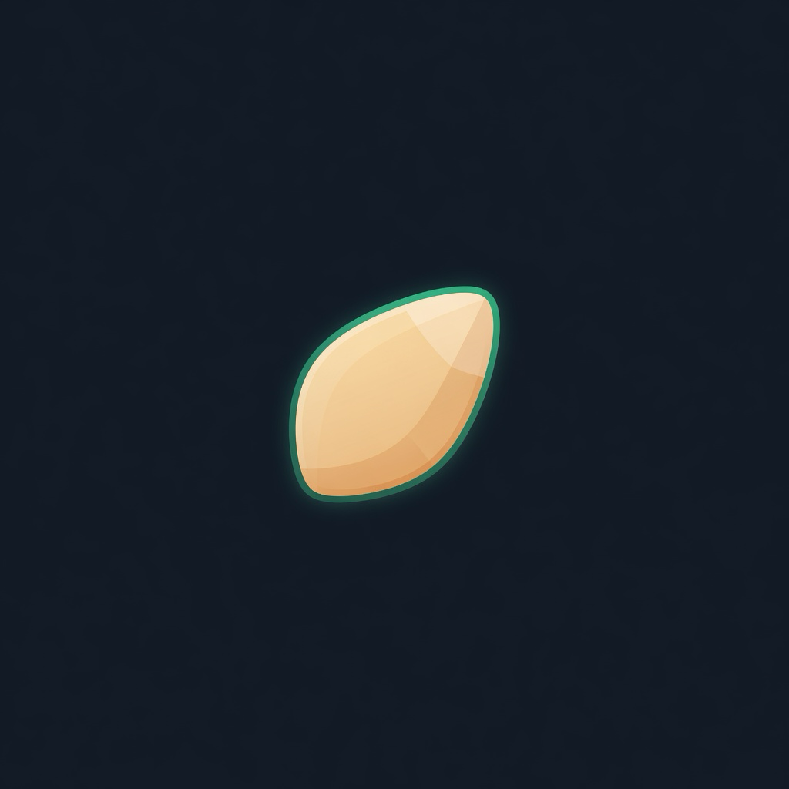

# grain

<p align="center">
  
</p>

<p align="center">
  <strong>Linux microVM sandboxes on your own hardware.</strong><br>
  <a href="https://grainvm.com">Documentation</a>
  ·
  <a href="https://grainvm.com/get-started/quickstart/">Quick start</a>
  ·
  <a href="https://github.com/cxdy/grain/releases">Releases</a>
</p>

<p align="center">
  Apache-2.0
  · macOS &amp; Linux
</p>

grain runs small, disposable Linux VMs locally — for a shell, for [GitHub Actions](https://grainvm.com/guides/recipes/act/) (`grain act`), or for a [throwaway k3s](https://grainvm.com/guides/recipes/k3s/) lab. Ephemeral by default; persistent when you want it.

---

## Install

```bash
curl -fsSL https://raw.githubusercontent.com/cxdy/grain/main/scripts/install.sh | bash
```

Install QEMU, then check dependencies:

```bash
# macOS
brew install qemu

# Debian / Ubuntu
# sudo apt-get install -y qemu-system qemu-utils

grain doctor
```

---

## First sandbox

```bash
grain up
grain image pull grain-ubuntu
grain new
grain sh
```

When you’re done:

```bash
grain rm
grain down
```

Optional starter config and more flags: **[quick start](https://grainvm.com/get-started/quickstart/)**.

### MCP (coding agents)

Expose sandboxes to Claude Code, Codex, OpenCode, Grok Build, and other MCP hosts:

```bash
just build-mcp    # bin/grain-mcp (stdio; needs grain up)
```

→ [MCP server guide](https://grainvm.com/guides/mcp/) (tool list + host config)

---

## Workloads

### GitHub Actions

Run [nektos/act](https://github.com/nektos/act) inside an isolated microVM so host Docker stays clean.

```bash
cd /path/to/your/repo
grain act -- -l          # list workflows
grain act -- -j test     # run a job
```

→ [act guide](https://grainvm.com/guides/recipes/act/)

### k3s lab

Single-node Kubernetes with the API published to the host.

```bash
grain new --preset k3s -n lab -p --wait userdata
grain fwd ls lab         # host port → guest 6443
```

→ [k3s guide](https://grainvm.com/guides/recipes/k3s/)

---

## Features

| Area | What you get |
|------|----------------|
| **CLI** | `up` · `new` · `sh` · `x` · `rm` · mounts · port forwards · profiles |
| **Presets** | `act` · `k3s` · `docker` |
| **Guest agent** | Exec, shell, file copy, and fs ops without living in SSH |
| **API** | Unix socket + optional TCP · [OpenAPI](api/openapi.yaml) |
| **SDKs** | [Go](https://pkg.go.dev/github.com/cxdy/grain/client) · [TypeScript](https://www.npmjs.com/package/@cxdy/grain) · [Python](https://pypi.org/project/grainvm/) |

---

## Docs

| Page | |
|------|--|
| [Install](https://grainvm.com/get-started/install/) | Platforms and install options |
| [Quick start](https://grainvm.com/get-started/quickstart/) | Config + first VM |
| [First sandbox](https://grainvm.com/get-started/first-sandbox/) | Tutorial + interactive demo |
| [act](https://grainvm.com/guides/recipes/act/) | GitHub Actions in a microVM |
| [k3s](https://grainvm.com/guides/recipes/k3s/) | Single-node cluster preset |
| [Guides](https://grainvm.com/guides/) | Images, agent, networking, mounts, proxy |
| [Reference](https://grainvm.com/reference/cli/) | CLI, config, API, SDKs |

The site is built from this repo’s `docs/` directory.

---

## Develop

```bash
just test        # unit tests (mock hypervisor)
just smoke-api   # CLI + daemon e2e without QEMU
just build
```

[Contributing](CONTRIBUTING.md) · [Security](SECURITY.md) · [Code of conduct](CODE_OF_CONDUCT.md) · [Releasing](docs/developer/releasing.md)

## License

[Apache-2.0](LICENSE)
